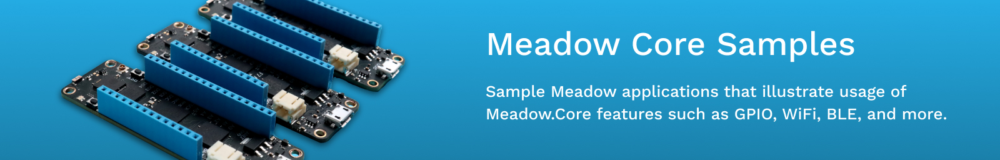

# Meadow.Core.Samples

* [Blinky (C#, F#, VB.NET)](/Source/Blinky) 
* [Bluetooth](/Source/Bluetooth/Bluetooth_Basics)
* [Board Specific Samples](/Source/Board_Specific_Samples)
    * [F7 Feather V2](/Source/Board_Specific_Samples/F7_Micro)
    * [Core Computer Module](/Source/Board_Specific_Samples/CoreComputeBreakout)
* [IO Samples](/Source/IO)
    * [Analog Input Port](/Source/IO/AnalogInputPort)
    * [Bidirectional Port](/Source/IO/BiDirectonalPort)
    * [Counter](/Source/IO/Counter)
    * [Digital Input Port](/Source/IO/DigitalInputPort)
    * [Digital Input Port (Observable)](/Source/IO/DigitalInputPort_IObservable)
    * [GPIO Interrogation](/Source/IO/GpioInterrogation)
    * [Hello LED](/Source/IO/Hello_LED)
    * [Hello LED (F#)](/Source/IO/HelloLED_F%23)
    * [I2C](/Source/IO/I2C)
    * [PWM](/Source/IO/PWM)
    * [Serial Listener](/Source/IO/SerialListener)
    * [Serial Message Port](/Source/IO/SerialMessagePort)
    * [Serial Port](/Source/IO/SerialPort)
    * [Serial Port Echo](/Source/IO/SerialPort_Echo)
    * [SPI](/Source/IO/SPI)
* [Json Basics](/Source/Json_Basics)
* [Network](/Source/Network)
    * [Antenna Switching](/Source/Network/Antenna_Switching)
    * [HttpListener Basics](/Source/Network/HttpListener_Basics)
    * [WIFI Basics (C#, VB.NET)](/Source/Network/WiFi_Basics)
* [OS](/Source/OS)
    * [Battery Level](/Source/OS/BatteryLevel)
    * [BeginInvokeOnMainThread](/Source/OS/BeginInvokeOnMainThread)
    * [Config Files](/Source/OS/Config_Files)
    * [File System Basics (C#, VB.NET)](/Source/OS/FileSystem_Basics)
    * [Logging (C#, VB.NET)](/Source/OS/Logging)
    * [MCU Temperature](/Source/OS/McuTemp)
    * [Power Manager](/Source/OS/Power_Manager)
    * [Real Time Clock](/Source/OS/RealTimeClock)
    * [SDCard](/Source/OS/SDCard/CS)
    * [SQLite (C#, VB.NET)](/Source/OS/SQLite)
    * [Threading](/Source/OS/Threading)
    * [Threading.Tasks](/Source/OS/Threading.Tasks)
    * [Update](/Source/OS/Update)
    * [Watchdog](/Source/OS/Watchdog)
* [Walking Digital Outputs](/Source/Utilities/Walking_DigitalOutputs)

For peripheral samples, see the [Meadow.Foundation repo](https://github.com/wildernesslabs/Meadow.Foundation).

For project samples, see the [Meadow projects on Hackster.io](https://www.hackster.io/WildernessLabs/projects?sort=published).
